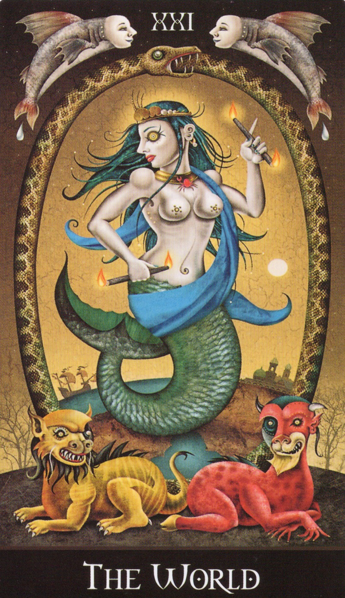

# 😴 Sleep Ritual: Entering the World  
**Deviant Moon Tarot「世界」カードを使った睡眠前の内的ワーク**

---

## 🧙‍♀️ 概要（日本語）

このワークは、本棚神殿の前で行う正式な儀式ではなく、眠りに入る直前の「簡易的なマントラ」として設計されています。使用するカードはDeviant Moon Tarotの「The World」。視覚化と祈りを通じて、ヘカテの守護を受けながら深い眠りへと入っていきます。

---

## 🌕 手順（概要）

1. **カードの観相**  
   Deviant Moon Tarotの「世界」のカードを静かに見つめ、構図や細部を心に焼き付けます。

2. **カードを戻す**  
   デッキにカードを戻し、ライトを消してベッドに入ります。

3. **マントラの語り**  
   以下のマントラを心の中で唱えます：

   ### 🔤 英語部分
   > Hail to thee, Hekate, Light of the Crossroads.  
   > As I drift into the realm of dreams,  
   > Let the stars form a temple above me.  
   >  
   > Let the World unfold, vast and calm,  
   > and welcome me into its endless dance.  
   >  
   > Watch over me, Hekate, as I sleep.  
   > Guide my soul along paths of peace.

   ### 🈶 日本語部分
   > （交差点の光、ヘカテよ、あなたに呼びかけます  
   > 私が夢の領域へと漂うとき  
   > 星々が私の上に聖域を形作りますように  
   > 世界のカードが広がり、雄大で穏やかなものとなり  
   > 私をその終わりなき舞踏へと迎え入れてください  
   > 眠りの中、私を見守ってください、ヘカテよ  
   > 平和の小径を、私の魂が進みますように

4. **視覚化**  
   心の中でカードを夜空に投影し、それが太陽系、銀河系、宇宙全体にまで広がっていくイメージを組み立てます。やがて、その世界に自分自身が入り込み、ヘカテの守護を受けながら、広がる世界の内にしずかに沈んでいくように眠りに入ります。

---

## 🖼️ タロット例（小サイズ）

---

## 📋 License
This work is part of the Open Source Witchcraft project.  
Distributed under Creative Commons BY-SA 4.0 License.

GitHub: https://github.com/ravensgate-tux
